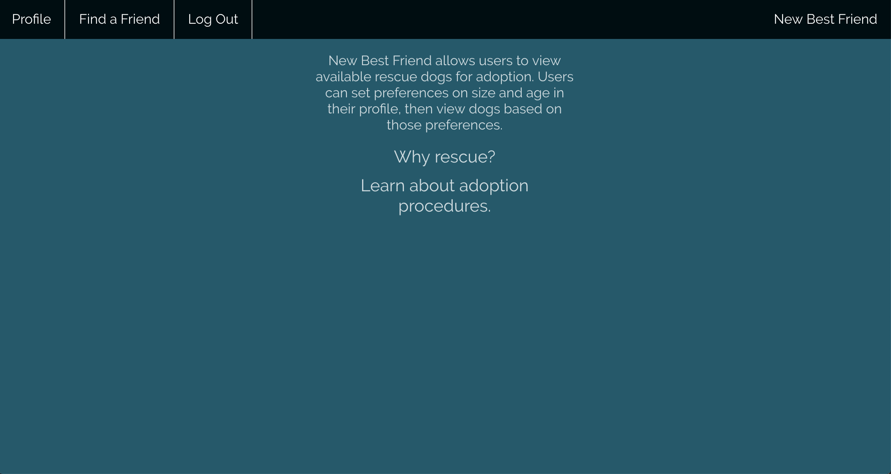
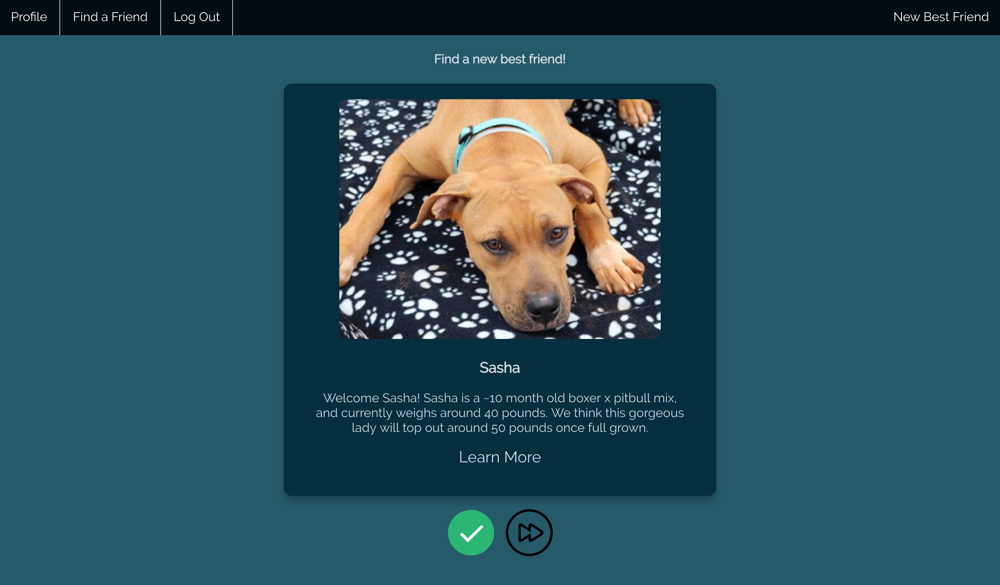
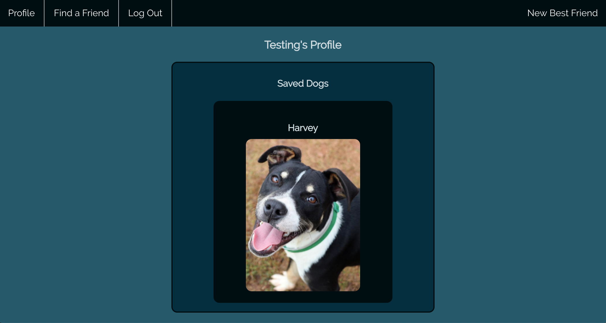
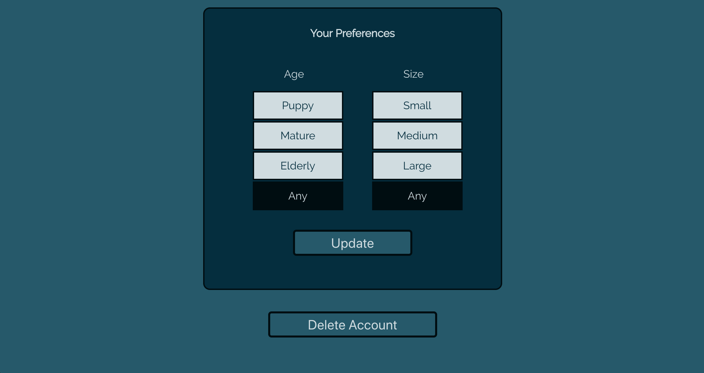

# New Best Friend

_Rescue the perfect dog for you_

## Live App
---
You can view a live version of the application [here](https://new-best-friend.herokuapp.com "New Best Friend").

Login with the following test user:

| Username | Password |
|:--------:|:--------:|
|testuser12|testuser12|

Or feel free to create your own user!

## Screenshots
---
### Landing Page

Users will see this page upon logging in. It provides a quick overview of what the app does, as well as helpful links about the adoption process and why users should always rescue.

### Find a Friend Page

This page displays available dogs to be rescued, based on the user's preferences. Each dog will have a photo, their name, and a short "About" section, as well as a link to learn more information. Links will lead users to the dog's page on the [Athens Canine Rescue](http://athenscaninerescue.com/) website.

Clicking the green checkmark button will add the dog to the user's "Saved Dogs" list so they can view that dog again later. The next button moves the user to the next available dog.

### Profile Page

This page allows users to view all the dogs they have saved. Clicking the dog's image will take the user to that dog's page on the [Athens Canine Rescue](http://athenscaninerescue.com/) website.

Users can also update their preferences from this page. Simply select your preferences, then click "Update" to save.

Should they feel the need, users can also delete their account from this page.

## API Documentation
---
The _New Best Friend_ API is a relatively simple API containing two major endpoints: one for dogs, and one for users. All endpoints (except account creation and login) require a valid JWT. The API's repo can be viewed [here](https://github.com/rcaseyx/nbfapi). 

### /dogs

In it's current state, the dogs endpoint accepts `GET` request types. Requests can include the following parameters:

`dogs/<dog_id>`

or

`dogs/<age_preference>/<size_preference>`

The second option allows for filtering based on user preferences. This filtering is done on the backend to improve frontend performance, rather than trying to filter in the React code.

### /users

The users endpoint can currently accept the following request types:

* `POST`
* `GET`
* `DELETE`

`POST` requests to the endpoint create new users. These requests require the following fields in the request body:

*  `username`
*  `password`

Other optional fields include `firstName` and `lastName`.

`GET` requests must include the user ID in the parameters. This is used to grab individual user information.

`DELETE` requests must also include the user ID in the parameters. This will remove the user from the database.

## Future Iterations
---
In the future, I'd like to expand _New Best Friend_ to be more comprehensive.

Ideally, a web scraper would be set up to grab dog data from multiple rescue sites and store it in the database. This data would include the dogs location, likely by zip code.

With this new data, I'd set up an additional preference for "X Miles Near Zip Code XXXXX". This would allow users to find dogs near them, no matter where they are located.

Another feature I'd like to implement is a separate login for rescue organizations. These organizations would set "Organization" accounts that would grant them special privileges within the API, including the ability to `POST` new dogs for adoption. This could also lead to a "Contact the Rescue" feature for users.

## Technology Used
---
| Frontend |
| :------: |
| [React](https://reactjs.org/) |
| [Redux](https://redux.js.org/) |
| [Redux-Form](https://redux-form.com/8.1.0/)|
| [React-Loader-Spinner](https://www.npmjs.com/package/react-loader-spinner) |
| [JWT-decode](https://www.npmjs.com/package/jwt-decode) |
| [Enzyme](https://airbnb.io/enzyme/) |

| Backend |
| :-----: |
| [NodeJs](https://nodejs.org/en/about/) |
| [Express](https://expressjs.com/) |
| [MongoDb](https://www.mongodb.com/) |
| [Mongoose](https://mongoosejs.com/) |
| [JWT](https://jwt.io/) |
| [Passport](http://www.passportjs.org/) |
| [bcryptjs](https://www.npmjs.com/package/bcryptjs) |
| [Morgan](https://www.npmjs.com/package/morgan/v/1.1.1) |
| [Faker](https://www.npmjs.com/package/faker) |
| [Mocha](https://mochajs.org/) |
| [Chai](https://www.chaijs.com/) |
